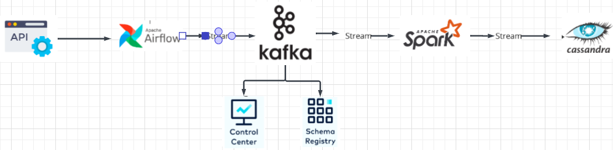

# Realtime End-to-End Data Streaming Pipeline 

## Summary

This project aims to build an end-to-end data pipeline from API, data ingestion and to store processed data to cassandra db.

## Architecture

## Technology Used
- Programming Language - Python
- Apache Spark
- Apache Airflow
- Apache Zookeeper
- Apache Kafka
- Docker
- Confluent Schema Registry, Control Center

## Guided project From Yusuf Ganiyu
